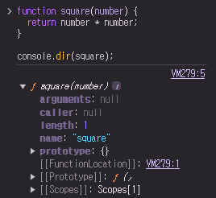
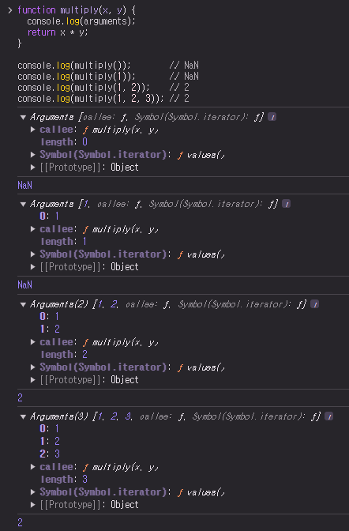

# 18. 함수와 일급 객체

## 18.1. 일급 객체

- 아래의 조건을 만족하는 객체

  > 1. 무명의 리터럴로 생성할 수 있음. 즉, 런타임에 생성 가능
  > 2. 변수나 자료구조(객체, 배열 등)에 저장 가능
  > 3. 함수의 매개변수에 전달 가능
  > 4. 함수의 반환값으로 사용 가능

- 자바스크립트의 함수는 위의 조건을 모두 만족하므로 일급 객체

  ```javascript
  // 1. 함수는 무명의 리터럴로 생성할 수 있음
  // 2. 함수는 변수에 저장할 수 있음
  // 런타임(할당 단계)에 함수 리터럴이 평가되어 함수 객체가 생성되고 변수에 할당됨
  const increase = function (num) {
    return ++num;
  };

  const decrease = function (num) {
    return --num;
  };

  // 2. 함수는 객체에 저장 가능
  const auxs = { increase, decrease };

  // 3. 함수의 매개변수에 전달할 수 있음
  // 4. 함수의 반환값으로 사용할 수 있음
  function makeCounter(aux) {
    let num = 0;

    return function () {
      num = aux(num);
      return num;
    };
  }

  // 3. 함수는 매개변수에 함수를 전달할 수 있음
  const increaser = makeCounter(auxs.increase);
  console.log(increaser()); // 1
  console.log(increaser()); // 2

  // 3. 함수는 매개변수에 함수를 전달할 수 있음
  const decreaser = makeCounter(auxs.decrease);
  console.log(decreaser()); // -1
  console.log(decreaser()); // -2
  ```

<br/>

- 함수가 일급 객체라는 것은 **함수를 객체와 동일하게 사용할 수 있다**는 의미
  - 객체는 값이므로 함수는 값과 동일하게 취급할 수 있음
  - 함수는 값을 사용할 수 있는 곳(변수 할당문, 객체의 프로퍼티 값, 배열의 요소, 함수 호출의 인수, 함수 반환문)이라면 어디서든지 리터럴로 정의할 수 있으며 런타임(runtime)에 함수 객체로 평가됨
- 일급 객체로서 함수가 가지는 가장 큰 특징은 일반 객체와 같이 함수의 매개변수에 전달할 수 있으며, 함수의 반환값으로 사용할 수도 있다는 것
  - 함수형 프로그래밍을 가능케 하는 자바스크립트의 장점 중 하나
- 함수는 객체이지만 일반 객체와는 차이가 있음
  - 일반 객체는 호출할 수 없지만 **함수 객체는 호출할 수 있음**
  - 함수 객체는 일반 객체에는 없는 **함수 고유의 프로퍼티를 소유함**

<br/><br/>

## 18.2. 함수 객체의 프로퍼티

- 함수는 객체이기 때문에, 함수도 프로퍼티를 가질 수 있음

```javascript
function square(number) {
  return number * number;
}

// 함수 객체의 내부 확인
console.dir(square);
```



<br/>

```javascript
function square(number) {
  return number * number;
}

// square 함수의 모든 프로퍼티의 어트리뷰트 확인
console.log(Object.getOwnPropertyDescriptors(square));
/*
{
  length: {value: 1, writable: false, enumerable: false, configurable: true},
  name: {value: "square", writable: false, enumerable: false, configurable: true},
  arguments: {value: null, writable: false, enumerable: false, configurable: false},
  caller: {value: null, writable: false, enumerable: false, configurable: false},
  prototype: {value: {...}, writable: true, enumerable: false, configurable: false}
}
*/

// __proto__는 square 함수의 프로퍼티가 아님
console.log(Object.getOwnPropertyDescriptor(square, "__proto__")); // undefined

// __proto__는 Object.prototype 객체의 접근자 프로퍼티
// square 함수는 Object.prototype 객체로부터 __proto__ 접근자 프로퍼티를 상속받음
console.log(Object.getOwnPropertyDescriptor(Object.prototype, "__proto__"));
// {get: ƒ, set: ƒ, enumerable: false, configurable: true}
```

- `arguments`, `caller`, `length`, `name`, `prototype` 프로퍼티는 모두 함수 객체의 데이터 프로퍼티
  - 일반 객체에는 없는 함수 객체 고유의 프로퍼티
- `__proto__`는 접근자 프로퍼티이며, 함수 객체 고유의 프로퍼티가 아니라 `Object.prototype` 객체의 프로퍼티를 상속받은 것
- `Object.prototype` 객체의 프로퍼티는 모든 객체가 상속받아 사용할 수 있음
  - `Object.prototype` 객체의 `__proto__` 접근자 프로퍼티는 모든 객체가 사용할 수 있음

<br/>

### 18.2.1. `arguments` 프로퍼티

- 함수 객체의 `arguments` 프로퍼티 값은 `arguments` 객체
  - `arguments` 객체는 함수 호출 시 전달된 인수(argument)들의 정보를 담고 있는 순회 가능한(iterable) 유사 배열 객체이며, 함수 내부에서 지역 변수처럼 사용됨
  - 함수 외부에서는 참조할 수 없음
- 함수 객체의 `arguments` 프로퍼티는 현재 일부 브라우저에서 지원하고 있지만 ES3부터 표준에서 폐지되었음
  - `Function.arguments`와 같은 사용법은 권장되지 않으며 함수 내부에서 지역 변수처럼 사용할 수 있는 `arguments` 객체를 참조하도록 함

<br/>

- 자바스크립트는 함수의 매개변수와 인수의 개수가 일치하는지 확인하지 않음

  - 함수 호출 시 매개변수 개수만큼 인수를 전달하지 않아도 에러가 발생하지 않음

  ```javascript
  function multiply(x, y) {
    console.log(arguments);
    return x * y;
  }

  console.log(multiply()); // NaN
  console.log(multiply(1)); // NaN
  console.log(multiply(1, 2)); // 2
  console.log(multiply(1, 2, 3)); // 2
  ```

<br/>

- 함수를 정의할 때 선언한 매개변수는 함수 몸체 내부에서 변수와 동일하게 취급됨
  - 함수가 호출되면 함수 몸체 내에서 암묵적으로 매개변수가 선언되고 `undefined`로 초기화된 이후 인수가 할당됨
- 선언된 매개변수의 개수보다 인수를 적게 전달했을 경우(`multiply()`, `multiply(1)`) 인수가 전달되지 않은 매개변수는 `undefined`로 초기화된 상태를 유지함
  - 매개변수의 개수보다 인수를 더 많이 전달한 경우(`multiply(1, 2, 3)`) 초과된 인수는 무시됨
- 초과된 인수가 그냥 버려지는 것은 아님

  - 모든 인수는 암묵적으로 `arguments` 객체의 프로퍼티로 보관됨

  

<br/>

- `arguments` 객체는 인수를 프로퍼티 값으로 소유하며 프로퍼티 키는 인수의 순서를 나타냄
- `arguments` 객체의 `callee` 프로퍼티: 호출되어 `arguments` 객체를 생성한 함수, 즉 함수 자신
- `arguments` 객체의 `length` 프로퍼티: 인수의 개수

<br/>

> **`arguments` 객체의 `Symbol`(`Symbol.iterator`) 프로퍼티**
>
> - `arguments` 객체를 순회 가능한 자료구조인 이터러블(iterable)로 만들기 위한 프로퍼티
> - `Symbol.iterator`를 프로퍼티 키로 사용한 메서드를 구현하는 것에 의해 이터러블이 됨
>
> ```javascript
> function multiply(x, y) {
>   // 이터레이터
>   const iterator = arguments[Symbol.iterator]();
>
>   // 이터레이터의 next 메서드를 호출하여 이터러블 객체 >arguments를 순회
>   console.log(iterator.next()); // {value: 1, done: >false}
>   console.log(iterator.next()); // {value: 2, done: >false}
>   console.log(iterator.next()); // {value: 3, done: >false}
>   console.log(iterator.next()); // {value: undefined, >done: true}
>
>   return x * y;
> }
>
> multiply(1, 2, 3);
> ```

<br/>

- 선언된 매개변수의 개수와 함수를 호출할 때 전달하는 인수의 개수를 확인하지 않는 자바스크립트의 특성 때문에 함수가 호출되면 인수 개수를 확인하고 이에 따라 함수의 동작을 달리 정의할 필요가 있을 수 있음
  - 이때 유용하게 사용되는 것이 `arguments` 객체

<br/>

- `arguments` 객체는 매개변수 개수를 확정할 수 없는 **가변 인자 함수**를 구현할 때 유용함

  ```javascript
  function sum() {
    let res = 0;

    // arguments 객체는 length 프로퍼티가 있는 유사 배열 객체이므로 for 문으로 순회할 수 있음
    for (let i = 0; i < arguments.length; i++) {
      res += arguments[i];
    }

    return res;
  }

  console.log(sum()); // 0
  console.log(sum(1, 2)); // 3
  console.log(sum(1, 2, 3)); // 6
  ```

- `arguments` 객체는 배열 형태로 인자 정보를 담고 있지만 실제 배열이 아닌 유사 배열 객체(array-like object)
  - 유사 배열 객체: `length` 프로퍼티를 가진 객체로 `for` 문으로 순회할 수 있는 객체

<br/>

> **유사 배열 객체와 이터러블**
>
> - ES6에서 도입된 이터레이션 프로토콜을 준수하면 순회 가능한 자료구조인 이터러블이 됨
> - 이터러블의 개념이 없었던 ES5에서 `arguments` 객체는 유사 배열 객체로 구분되었음
> - 하지만 이터러블이 도입된 ES6부터 `arguments` 객체는 유사 배열 객체이면서 동시에 이터러블임

<br/>

- 유사 배열 객체는 배열이 아니므로 배열 메서드를 사용할 경우 에러 발생
- 배열 메서드를 사용하려면 `Function.prototype.call`, `Function.prototype.apply`를 사용해 간접 호출해야 하는 번거로움 있음

  ```javascript
  function sum() {
    // arguments 객체를 배열로 변환
    const array = Array.prototype.slice.call(arguments);
    return array.reduce(function (pre, cur) {
      return pre + cur;
    }, 0);
  }

  console.log(sum(1, 2)); // 3
  console.log(sum(1, 2, 3, 4, 5)); // 15
  ```

- 이러한 번거로움을 해결하기 위해 ES6에서는 Rest 파라미터를 도입함

  ```javascript
  // ES6 Rest parameter
  function sum(...args) {
    return args.reduce((pre, cur) => pre + cur, 0);
  }

  console.log(sum(1, 2)); // 3
  console.log(sum(1, 2, 3, 4, 5)); // 15
  ```

<br/>

### 18.2.2. `caller` 프로퍼티

- ECMAScript 사양에 포함되지 않는 비표준 프로퍼티
  - 이후 표준화될 예정도 없는 프로퍼티이므로 사용하지 말고 참고로만 알아두기
- 함수 객체의 `caller` 프로퍼티는 함수 자신을 호출한 함수를 가리킴

  ```javascript
  function foo(func) {
    return func();
  }

  function bar() {
    return "caller : " + bar.caller;
  }

  // 브라우저에서의 실행한 결과
  console.log(foo(bar)); // caller : function foo(func) {...}
  console.log(bar()); // caller : null
  ```

- 함수 호출 `foo(bar)`의 경우 `bar` 함수를 `foo` 함수 내에서 호출함
  - `bar` 함수의 `caller` 프로퍼티는 `bar` 함수를 호출한 `foo` 함수를 가리킴
- 함수 호출 `bar()`의 경우 `bar` 함수를 호출한 함수는 없음
- 따라서 `caller` 프로퍼티는 `null`을 가리킴
- 위 결과는 브라우저에서 실행한 결과

<br/>

### 18.2.3. `length` 프로퍼티

- 함수 객체의 `length` 프로퍼티는 함수를 정의할 때 선언한 **매개변수의 개수**를 가리킴

  ```javascript
  function foo() {}
  console.log(foo.length); // 0

  function bar(x) {
    return x;
  }
  console.log(bar.length); // 1

  function baz(x, y) {
    return x * y;
  }
  console.log(baz.length); // 2
  ```

- `arguments` 객체의 `length` 프로퍼티와 함수 객체의 `length` 프로퍼티의 값은 다를 수 있으므로 주의해야 함
- `arguments` 객체의 `length` 프로퍼티는 인자(argument)의 개수를 가리키고, 함수 객체의 `length` 프로퍼티는 매개 변수(parameter)의 개수를 가리킴

<br/>

### 18.2.4. `name` 프로퍼티

- 함수 객체의 `name` 프로퍼티는 **함수 이름**을 나타냄
- `name` 프로퍼티는 ES6 이전까지는 비표준이었다가 ES6에서 정식 표준이 됨
- `name` 프로퍼티는 ES5와 ES6에서 동작을 달리하므로 주의해야 함

  - 익명 함수 표현식의 경우 ES5에서 `name` 프로퍼티는 빈 문자열을 값으로 가짐
  - ES6에서는 함수 객체를 가리키는 식별자를 값으로 가짐

  ```javascript
  // 기명 함수 표현식
  var namedFunc = function foo() {};
  console.log(namedFunc.name); // foo

  // 익명 함수 표현식
  var anonymousFunc = function () {};
  // ES5: name 프로퍼티는 빈 문자열을 값으로 가짐
  // ES6: name 프로퍼티는 함수 객체를 가리키는 변수 이름을 값으로 가짐
  console.log(anonymousFunc.name); // anonymousFunc

  // 함수 선언문(Function declaration)
  function bar() {}
  console.log(bar.name); // bar
  ```

- 함수 이름과 함수 객체를 가리키는 식별자는 의미가 다름
- 함수를 호출할 때는 함수 이름이 아닌 함수 객체를 가리키는 식별자로 호출함

<br/>

### 18.2.5. __proto\__ 접근자 프로퍼티

- 모든 객체는 `[[Prototype]]`이라는 내부 슬롯을 가짐
- `[[Prototype]]` 내부 슬롯은 객체지향 프로그래밍의 상속을 구현하는 프로토타입 객체를 가리킴
- `__proto__` 프로퍼티는 `[[Prototype]]` 내부 슬롯이 가리키는 프로토타입 객체에 접근하기 위해 사용하는 접근자 프로퍼티

  - 내부 슬롯에 직접 접근할 수 없고 간접적인 접근 방법을 제공하는 경우에 한하여 접근 가능
  - `[[Prototype]]` 내부 슬롯에도 직접 접근할 수 없으며 `__proto__` 접근자 프로퍼티를 통해 간접적으로 프로토타입 객체에 접근 가능

  ```javascript
  const obj = { a: 1 };

  // 객체 리터럴 방식으로 생성한 객체의 프로토타입 객체는 Object.prototype
  console.log(obj.__proto__ === Object.prototype); // true

  // 객체 리터럴 방식으로 생성한 객체는 프로토타입 객체인 Object.prototype의 프로퍼티를 상속받음
  // hasOwnProperty 메서드는 Object.prototype의 메서드
  console.log(obj.hasOwnProperty("a")); // true
  console.log(obj.hasOwnProperty("__proto__")); // false
  ```

<br/>

> **`hasOwnProperty` 메서드**
>
> - 이름에서 알 수 있듯이 인수로 전달받은 프로퍼티 키가 객체 고유의 프로퍼티 키인 경우에만 `true`를 반환하고 상속받은 프로토타입의 프로퍼티 키인 경우 `false` 반환

<br/>

### 18.2.6. `prototype` 프로퍼티

- 생성자 함수로 호출할 수 있는 함수 객체, 즉 constructor만이 소유하는 프로퍼티
- 일반 객체와 생성자 함수로 호출할 수 없는 non-constructor에는 `prototype` 프로퍼티가 없음

  ```javascript
  // 함수 객체는 prototype 프로퍼티를 소유함
  (function () {}).hasOwnProperty("prototype"); // -> true

  // 일반 객체는 prototype 프로퍼티를 소유하지 않음
  ({}).hasOwnProperty("prototype"); // -> false
  ```

- `prototype` 프로퍼티는 함수가 객체를 생성하는 생성자 함수로 호출될 때 생성자 함수가 생성할 인스턴스의 프로토타입 객체를 가리킴
